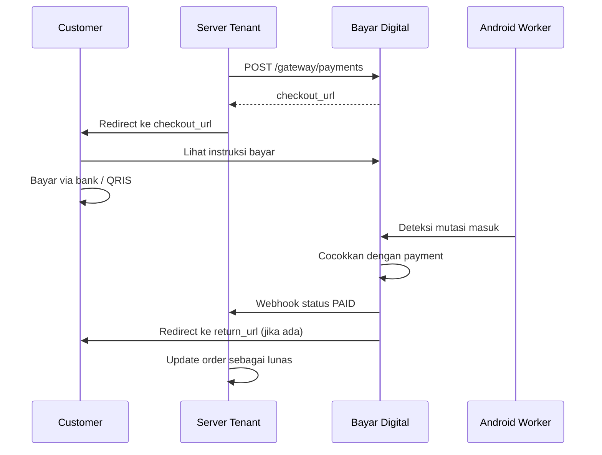

# Checkout

Halaman checkout adalah halaman Bayar Digital yang ditampilkan ke customer untuk melakukan pembayaran.

## Alur Checkout

1. Tenant membuat payment dan mendapat `checkout_url`.
2. Tenant mengarahkan customer ke `checkout_url`.
3. Customer melihat instruksi pembayaran (transfer bank atau QRIS).
4. Customer membayar sesuai instruksi.
5. Android Worker mendeteksi pembayaran masuk.
6. Status payment berubah menjadi `PAID`.
7. Customer diarahkan ke `return_url`.

## Yang Customer Lihat

Halaman checkout menampilkan:

- **Nominal**: `amount_total` yang harus dibayar (amount + unique code)
- **Metode bayar**: tergantung account yang dipilih tenant
  - **Transfer bank**: nama bank, nomor rekening, nama penerima
  - **QRIS**: kode QR yang bisa discan
- **Batas waktu**: countdown hingga `expires_at`
- **Status**: menunggu pembayaran, sudah dibayar, atau expired

## return_url

Saat membuat payment, tenant dapat mengirim `return_url`. URL ini adalah tujuan customer setelah menyelesaikan pembayaran:

- Jika customer menutup halaman checkout sebelum dibayar → customer tidak sampai ke `return_url`
- Jika payment sudah `PAID` pada saat checkout → customer otomatis diarahkan ke `return_url`
- Tenant harus memverifikasi status payment via webhook, **bukan** hanya dari redirect customer

## Expired Checkout

Jika payment melewati `expires_at`:

1. Halaman checkout menampilkan status expired.
2. Customer tidak bisa lanjut membayar.
3. Tenant harus membuat payment baru jika order masih perlu dibayar.
4. Jangan arahkan customer ke `checkout_url` lama.

## Best Practices

1. **Simpan `payment_code` dan `checkout_url`** di sisi tenant setelah create payment.
2. **Jangan anggap order lunas dari redirect saja**. Gunakan webhook sebagai sumber kebenaran.
3. **Tampilkan instruksi bayar sendiri** jika tidak ingin redirect ke halaman checkout Bayar Digital. Gunakan response dari create payment atau get payment.
4. **Beri batas waktu di sisi tenant** sesuai `expires_at`. Jangan tampilkan tombol "saya sudah bayar" — biarkan webhook yang memproses.
