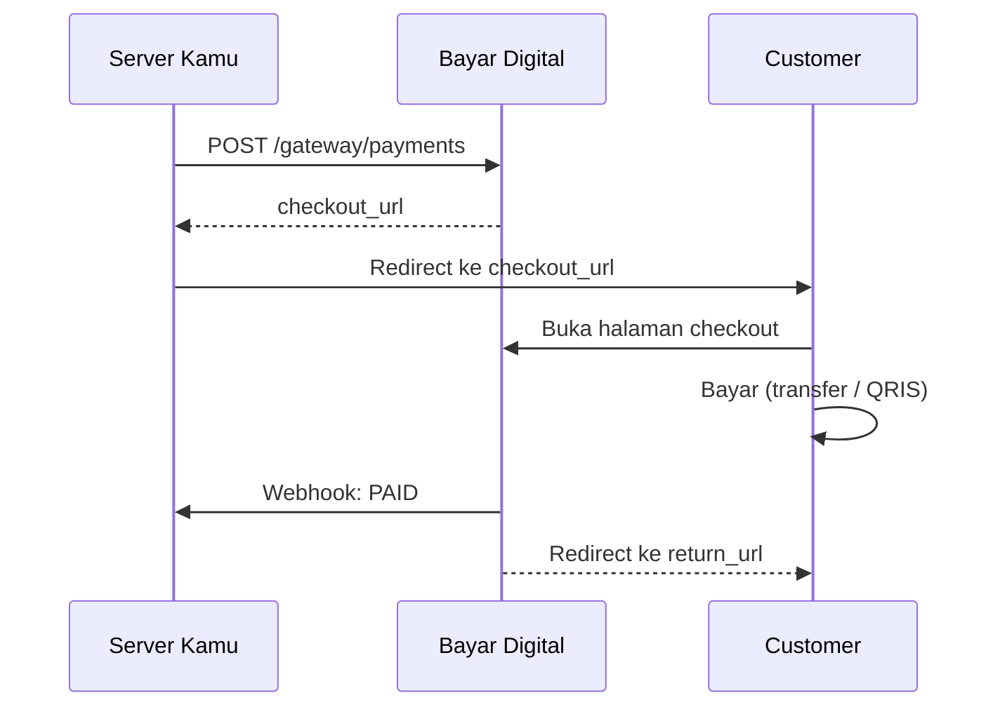

# Checkout

Halaman publik Bayar Digital untuk customer melakukan pembayaran. Customer tidak perlu login.

## URL

```
https://bayar.digital/checkout/{payment_id}
```

`payment_checkout_url` dikembalikan saat create payment sebagai URL absolut penuh (contoh: `https://bayar.digital/checkout/{payment_id}`).

## Alur



## Yang Customer Lihat

| Status | Tampilan |
| --- | --- |
| `PENDING` | Instruksi pembayaran, nominal, batas waktu |
| `PAID` | Konfirmasi sukses + tombol kembali ke merchant |
| `EXPIRED` / `CANCELLED` | Payment tidak tersedia |

Untuk **transfer bank**: nomor rekening + nominal `amount_total`.
Untuk **QRIS**: QR code dinamis dengan nominal spesifik.

## return_url

- Customer otomatis redirect ke `return_url` setelah status `PAID`
- Parameter `?payment_code={payment_code}` otomatis ditambahkan
- Hanya HTTPS yang diizinkan

:::warning
Jangan anggap order lunas dari redirect saja. Gunakan webhook sebagai sumber kebenaran.
:::

## Alternatif: Tampilkan Instruksi Sendiri

Kalau tidak ingin redirect ke checkout Bayar Digital, ambil detail pembayaran dari response create payment atau get payment, lalu tampilkan di UI kamu sendiri.

## Public API Response

Halaman checkout mengambil data dari endpoint publik:

```http
GET /checkout/{payment_id}
```

Contoh response transfer bank:

```json
{
  "success": true,
  "message": "ok",
  "data": {
    "payment_code": "INV-2026-0001",
    "amount_original": 50000,
    "amount_unique": 123,
    "amount_total": 50123,
    "status": "PENDING",
    "expires_at": "2026-10-11T12:00:00Z",
    "created_at": "2026-06-11T10:00:00Z",
    "customer_name": "Budi Santoso",
    "customer_email": "budi@example.com",
    "customer_phone": "081234567890",
    "return_url": "https://yourserver.com/orders/INV-2026-0001",
    "redirect_url": "https://yourserver.com/orders/INV-2026-0001?payment_code=INV-2026-0001",
    "order_items": "[{\"name\":\"Produk A\",\"price\":50000,\"quantity\":1,\"subtotal\":50000}]",
    "account_number": "1234567890",
    "account_name": "PT Tenant Contoh",
    "bank_name": "BCA",
    "bank_type": "TRANSFER",
    "app_name": "BCA Mobile",
    "instructions": "[]"
  }
}
```

Untuk QRIS, response memakai `qris_payload` dinamis. `qris_static` tidak dikirim di response checkout.
