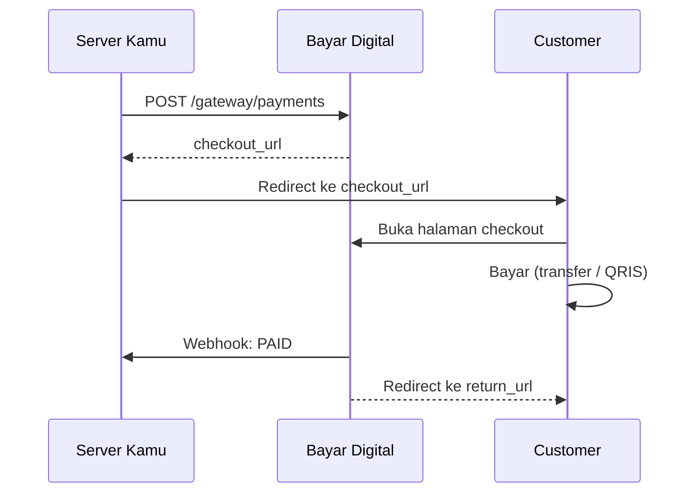

# Checkout

Halaman publik Bayar Digital untuk customer melakukan pembayaran. Customer tidak perlu login.

## URL

```
https://pay.bayar.digital/checkout/{payment_id}
```

`checkout_url` otomatis dikembalikan saat create payment.

## Alur



## Yang Customer Lihat

| Status | Tampilan |
| --- | --- |
| `PENDING` | Instruksi pembayaran, nominal, batas waktu |
| `PAID` | Konfirmasi sukses + tombol kembali ke merchant |
| `EXPIRED` / `CANCELLED` | Payment tidak tersedia |

Untuk **transfer bank**: nomor rekening + nominal `amount_total`.
Untuk **QRIS**: QR code dinamis dengan nominal spesifik.

## return_url

- Customer otomatis redirect ke `return_url` setelah status `PAID`
- Parameter `?payment_code={payment_code}` otomatis ditambahkan
- Hanya HTTPS yang diizinkan

:::warning
Jangan anggap order lunas dari redirect saja. Gunakan webhook sebagai sumber kebenaran.
:::

## Alternatif: Tampilkan Instruksi Sendiri

Kalau tidak ingin redirect ke checkout Bayar Digital, ambil detail pembayaran dari response create payment atau get payment, lalu tampilkan di UI kamu sendiri.
