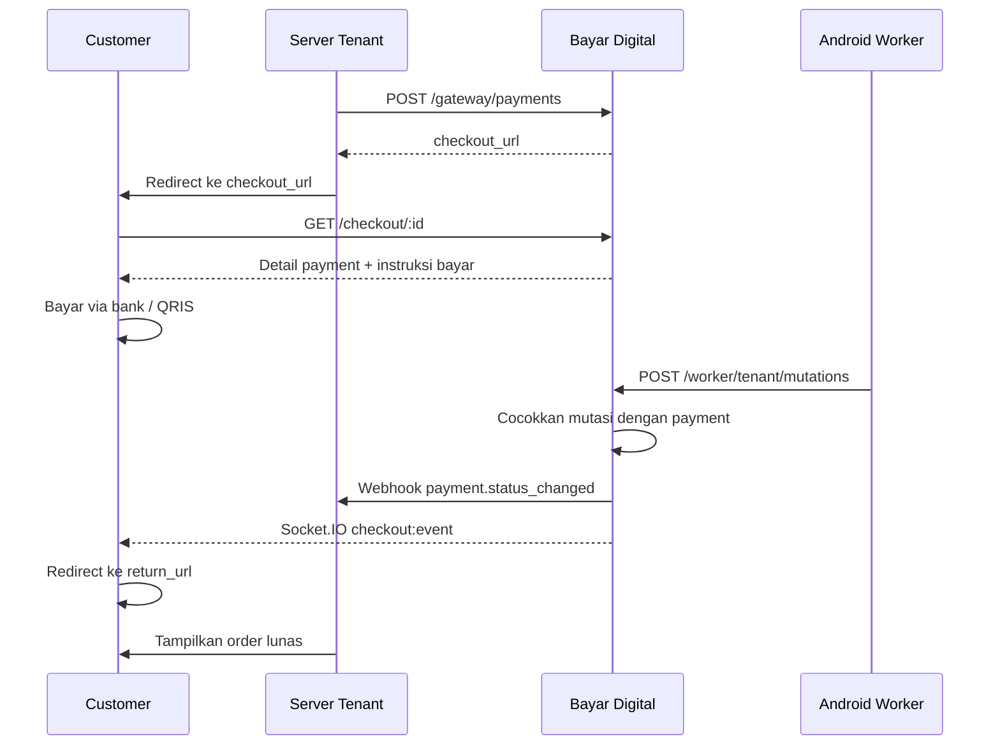

# Checkout

Halaman checkout adalah halaman publik Bayar Digital yang ditampilkan ke customer untuk melakukan pembayaran. Customer tidak perlu login.

## URL

`checkout_url` dikembalikan saat create payment dengan format:

```
/checkout/{payment_id}
```

URL lengkap di production: `https://pay.bayar.digital/checkout/{payment_id}`.

## Alur Checkout

1. Tenant membuat payment dan mendapat `checkout_url`.
2. Tenant mengarahkan customer ke `checkout_url`.
3. Customer melihat instruksi pembayaran (transfer bank atau QRIS).
4. Customer membayar sesuai instruksi.
5. Android Worker mendeteksi pembayaran masuk.
6. Status payment berubah menjadi `PAID`.
7. Customer otomatis diarahkan ke `return_url`.



## Yang Customer Lihat

### Status PENDING

- **Nominal**: `amount_total` dalam format IDR (amount + unique code)
- **Metode bayar** (tergantung account yang dipilih tenant):
  - **Transfer bank**: logo bank, nomor rekening (monospace + tombol copy), nama penerima
  - **QRIS**: QR code dinamis (QRIS payload dengan amount_total spesifik), merchant name, NMID
- **Informasi customer**: nama, email, nomor telepon
- **Daftar item** (jika `order_items` dikirim saat create payment): nama, qty, harga, gambar
- **Rincian**: `amount_original`, unique code (`+Rp XXX`), `amount_total`
- **Batas waktu**: tanggal dan jam kedaluwarsa (format `dd/MM/yyyy HH:mm`)
- **Petunjuk bayar**: langkah-langkah terjemahan dari konfigurasi channel

### Status PAID

- Centang hijau "Payment completed"
- Waktu pembayaran (`paid_at`)
- Tombol "Back to Merchant" (redirect ke `return_url`)

### Status EXPIRED / CANCELLED

- Teks merah "This payment is no longer available"

## Status Polling

Halaman checkout menggunakan **2 mekanisme** untuk update status:

1. **WebSocket (Socket.IO)** — real-time push event `checkout:event` saat status berubah. Terhubung ke server yang sama dengan path `/socket.io/`.
2. **HTTP Polling** — fallback setiap **5 detik** via `GET /checkout/:id`. Berhenti saat status tidak `PENDING`.

WebSocket adalah jalur utama. HTTP polling adalah safety net jika WebSocket gagal.

## return_url

Saat membuat payment, tenant dapat mengirim `return_url`. URL ini adalah tujuan customer setelah pembayaran sukses:

- Customer otomatis diarahkan ke `return_url` saat status berubah dari `PENDING` ke `PAID`.
- Parameter `?payment_code={payment_code}` otomatis ditambahkan ke URL agar tenant bisa mengidentifikasi payment.
- Redirect hanya terjadi sekali (dicegah double-redirect).
- Tenant harus memverifikasi status payment via webhook, **bukan** hanya dari redirect customer.
- URL divalidasi: hanya `https:` yang diizinkan. Protokol berbahaya seperti `javascript:` diblokir.

## Expired Checkout

Jika payment melewati `expires_at`:

1. Halaman checkout menampilkan status expired.
2. Status polling berhenti.
3. Customer tidak bisa lanjut membayar.
4. Tenant harus membuat payment baru jika order masih perlu dibayar.
5. Jangan arahkan customer ke `checkout_url` lama.

## QRIS Dinamis

Untuk payment QRIS, checkout menampilkan QR code yang **dinamis** — payload QRIS di-generate dengan `amount_total` spesifik untuk payment ini. Customer cukup scan dan nominal sudah terisi otomatis.

## Best Practices

1. **Simpan `payment_code` dan `checkout_url`** di sisi tenant setelah create payment.
2. **Jangan anggap order lunas dari redirect saja**. Gunakan webhook sebagai sumber kebenaran.
3. **Tampilkan instruksi bayar sendiri** jika tidak ingin redirect ke halaman checkout Bayar Digital. Gunakan response dari create payment atau get payment.
4. **Beri batas waktu di sisi tenant** sesuai `expires_at`. Jangan tampilkan tombol "saya sudah bayar" — biarkan webhook yang memproses.
