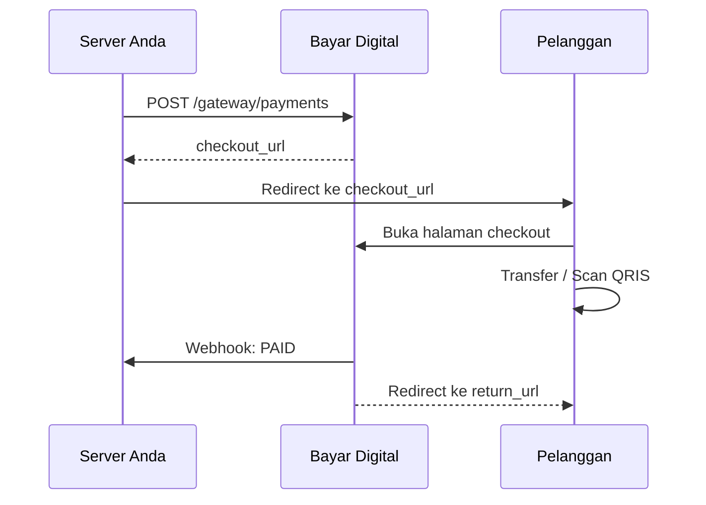

import Tabs from '@theme/Tabs';
import TabItem from '@theme/TabItem';

# Checkout

Halaman **Checkout** adalah antarmuka publik dari Bayar Digital yang memfasilitasi proses pembayaran. Pelanggan **tidak perlu login** atau memiliki akun untuk dapat menyelesaikan transaksi.

Setelah *invoice* berhasil dibuat, sistem Anda dapat langsung mengarahkan (*redirect*) pelanggan ke halaman ini. Tautan `payment_checkout_url` akan diberikan dalam bentuk URL absolut pada *response* saat Anda membuat *payment*.

**Alternatif Tanpa Redirect:**
Jika Anda lebih memilih menggunakan antarmuka (UI) aplikasi Anda sendiri, Anda tidak perlu melakukan *redirect*. Cukup ambil detail pembayaran (seperti nomor rekening, nominal total, dan instruksi) dari *response* `POST /gateway/payments` atau `GET /gateway/payments/{code}`, tampilkan di aplikasi Anda, dan pantau status pembayarannya melalui [Webhook](./webhook).

## Alur Redirect

Berikut adalah gambaran interaksi antara server Anda, Bayar Digital, dan Pelanggan saat menggunakan halaman Checkout:

## Tampilan Berdasarkan Status

Halaman *checkout* akan menyesuaikan tampilannya berdasarkan status pembayaran saat ini:

| Status Pembayaran | Tampilan Halaman |
| :--- | :--- |
| `PENDING` | Menampilkan instruksi pembayaran, nominal total yang harus dibayar, dan *countdown* batas waktu pembayaran. |
| `PAID` | Menampilkan halaman konfirmasi sukses beserta tombol untuk kembali ke *merchant*. |
| `EXPIRED` / `CANCELLED` | Halaman tidak tersedia atau menampilkan informasi bahwa tautan sudah tidak berlaku. |

### Detail Metode Pembayaran
* **Transfer Bank:** Menampilkan nomor rekening tujuan dan nominal pasti (`payment_total`).
* **QRIS:** Menampilkan QR Code dinamis dengan nominal yang sudah tertanam secara spesifik.

---

## Return URL (`return_url`)

Anda dapat menentukan ke mana pelanggan akan diarahkan setelah pembayaran berhasil dengan mengatur `return_url`. 

* Pelanggan akan dialihkan secara otomatis ke `return_url` setelah status transaksi berubah menjadi `PAID`.
* Parameter `?payment_code={payment_code}` akan ditambahkan secara otomatis pada URL akhir.
* **Syarat:** Hanya URL dengan protokol **HTTPS** yang diizinkan untuk alasan keamanan.

**Catatan Penting:**
**Jangan pernah** menjadikan *redirect* pelanggan ke `return_url` sebagai sumber kebenaran (Source of Truth) untuk memperbarui status transaksi di *database* Anda. Selalu gunakan **[Webhook](./webhook)** untuk memverifikasi dan memastikan bahwa pembayaran benar-benar telah berhasil (*PAID*).