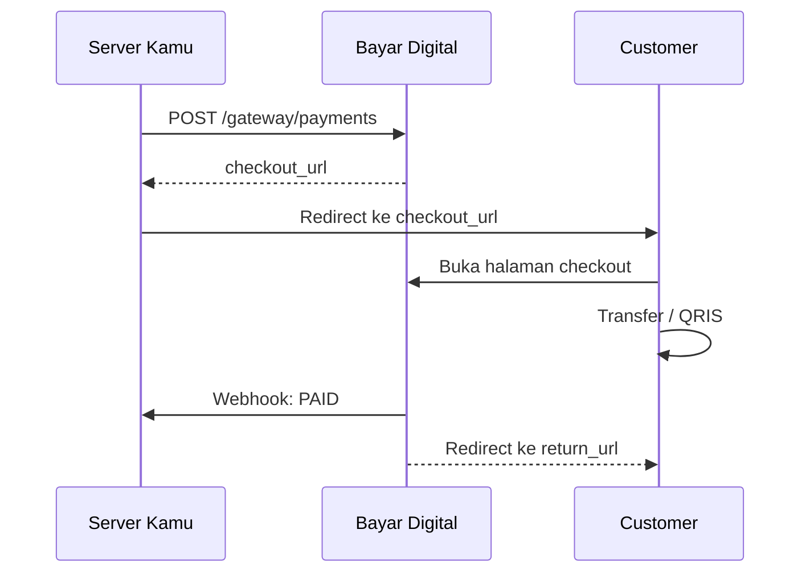

import Tabs from '@theme/Tabs';
import TabItem from '@theme/TabItem';

# Checkout

Halaman publik Bayar Digital untuk customer melakukan pembayaran. Customer **tidak perlu login** atau punya akun.

Setelah invoice dibuat, kamu bisa redirect customer ke halaman checkout ini. `payment_checkout_url` diberikan saat create payment sebagai URL absolut penuh.

**Alternatif:** Kalau tidak ingin redirect, kamu bisa tampilkan detail pembayaran (nomor rekening, nominal total, instruksi) di UI kamu sendiri. Ambil data dari response `POST /gateway/payments` atau `GET /gateway/payments/{code}`, lalu pantau status via [Webhook](./webhook).

## Alur Redirect



<table>
<thead>
<tr><th>Status</th><th>Tampilan</th></tr>
</thead>
<tbody>
<tr><td>`PENDING`</td><td>Instruksi pembayaran, nominal total, batas waktu mundur</td></tr>
<tr><td>`PAID`</td><td>Konfirmasi sukses + tombol kembali ke merchant</td></tr>
<tr><td>`EXPIRED` / `CANCELLED`</td><td>Halaman tidak tersedia</td></tr>
</tbody>
</table>

**Transfer bank:** menampilkan nomor rekening dan nominal `payment_total`.
**QRIS:** menampilkan QR Code dinamis dengan nominal spesifik.

### return_url

- Customer otomatis redirect ke `return_url` setelah status `PAID`
- Parameter `?payment_code={payment_code}` otomatis ditambahkan
- Hanya HTTPS yang diizinkan

**Jangan** jadikan redirect sebagai sumber kebenaran. Gunakan **webhook** untuk memastikan status payment.

---

## Request

Halaman checkout menggunakan endpoint publik (tanpa autentikasi).

<Tabs>
  <TabItem value="endpoint" label="Endpoint">
    <table>
    <thead>
    <tr><th>Method</th><th>URL</th></tr>
    </thead>
    <tbody>
    <tr><td>`GET`</td><td>`https://api.bayar.digital/checkout/{payment_id}`</td></tr>
    </tbody>
    </table>
  </TabItem>
  <TabItem value="param" label="Param">
    <table>
    <thead>
    <tr><th>Parameter</th><th>Tipe</th><th>Wajib</th><th>Deskripsi</th></tr>
    </thead>
    <tbody>
    <tr><td>`payment_id`</td><td>uuid</td><td>Ya</td><td>ID invoice (dari `payment_checkout_url`)</td></tr>
    </tbody>
    </table>
  </TabItem>
  <TabItem value="header" label="Header">
    <table>
    <thead>
    <tr><th>Header</th><th>Wajib</th><th>Deskripsi</th></tr>
    </thead>
    <tbody>
    <tr><td colspan="3">Tidak ada header.</td></tr>
    </tbody>
    </table>
  </TabItem>
  <TabItem value="body" label="Body">
    <table>
    <thead>
    <tr><th>Field</th><th>Tipe</th><th>Wajib</th><th>Deskripsi</th></tr>
    </thead>
    <tbody>
    <tr><td colspan="4">Tidak ada body.</td></tr>
    </tbody>
    </table>
  </TabItem>
  <TabItem value="contoh" label="Contoh" default>
    ```bash
    curl https://api.bayar.digital/checkout/660e8400-e29b-41d4-a716-446655440010
    ```
  </TabItem>
</Tabs>

## Response

<Tabs>
  <TabItem value="sukses" label="Sukses" default>
    <table>
    <thead>
    <tr><th>Field</th><th>Tipe</th><th>Deskripsi</th></tr>
    </thead>
    <tbody>
    <tr><td>`payment_code`</td><td>string</td><td>Kode invoice</td></tr>
    <tr><td>`amount_original`</td><td>int64</td><td>Nominal asli (tanpa nominal unik)</td></tr>
    <tr><td>`amount_unique`</td><td>int64</td><td>Nominal unik</td></tr>
    <tr><td>`amount_total`</td><td>int64</td><td>Total yang harus dibayar</td></tr>
    <tr><td>`status`</td><td>string</td><td>Status payment</td></tr>
    <tr><td>`expires_at`</td><td>datetime</td><td>Batas waktu pembayaran</td></tr>
    <tr><td>`created_at`</td><td>datetime</td><td>Waktu pembuatan</td></tr>
    <tr><td>`customer_name`</td><td>string</td><td>Nama customer</td></tr>
    <tr><td>`customer_email`</td><td>string/null</td><td>Email customer</td></tr>
    <tr><td>`customer_phone`</td><td>string/null</td><td>Telepon customer</td></tr>
    <tr><td>`return_url`</td><td>string/null</td><td>Redirect URL</td></tr>
    <tr><td>`redirect_url`</td><td>string/null</td><td>URL redirect dengan parameter `payment_code`</td></tr>
    <tr><td>`order_items`</td><td>string</td><td>Item pesanan (JSON string)</td></tr>
    <tr><td>`account_number`</td><td>string</td><td>Nomor rekening tujuan</td></tr>
    <tr><td>`account_name`</td><td>string</td><td>Nama pemilik rekening</td></tr>
    <tr><td>`bank_name`</td><td>string</td><td>Nama bank</td></tr>
    <tr><td>`bank_type`</td><td>string</td><td>`TRANSFER`</td></tr>
    <tr><td>`app_name`</td><td>string</td><td>Nama aplikasi mobile banking</td></tr>
    <tr><td>`instructions`</td><td>string</td><td>Instruksi pembayaran (JSON string)</td></tr>
    </tbody>
    </table>

    **200 OK**

    **Transfer Bank:**
    ```json
    {
      "success": true,
      "message": "ok",
      "data": {
        "payment_code": "INV-2026-0001",
        "amount_original": 50000,
        "amount_unique": 123,
        "amount_total": 50123,
        "status": "PENDING",
        "expires_at": "2026-10-11T12:00:00Z",
        "created_at": "2026-06-11T10:00:00Z",
        "customer_name": "Budi Santoso",
        "customer_email": "budi@example.com",
        "customer_phone": "081234567890",
        "return_url": "https://yourserver.com/orders/INV-2026-0001",
        "redirect_url": "https://yourserver.com/orders/INV-2026-0001?payment_code=INV-2026-0001",
        "order_items": "[{\"name\":\"Produk A\",\"price\":50000,\"quantity\":1,\"subtotal\":50000}]",
        "account_number": "1234567890",
        "account_name": "PT Merchant Contoh",
        "bank_name": "BCA",
        "bank_type": "TRANSFER",
        "app_name": "BCA Mobile",
        "instructions": "[]"
      }
    }
    ```

    **QRIS — Field Tambahan:**
    <table>
    <thead>
    <tr><th>Field</th><th>Tipe</th><th>Deskripsi</th></tr>
    </thead>
    <tbody>
    <tr><td>`qris_id`</td><td>string/null</td><td>NMID merchant</td></tr>
    <tr><td>`qris_name`</td><td>string/null</td><td>Nama merchant</td></tr>
    <tr><td>`qris_city`</td><td>string/null</td><td>Kota</td></tr>
    <tr><td>`qris_payload`</td><td>string/null</td><td>QRIS content string (untuk generate QR Code)</td></tr>
    </tbody>
    </table>

    `qris_payload` bersifat **dinamis** dengan nominal spesifik. Static QR tidak pernah diekspos.
  </TabItem>
  <TabItem value="gagal" label="Gagal">
    **404 Not Found**

    ```json
    {
      "success": false,
      "code": "not_found",
      "message": "payment not found"
    }
    ```
  </TabItem>
</Tabs>
