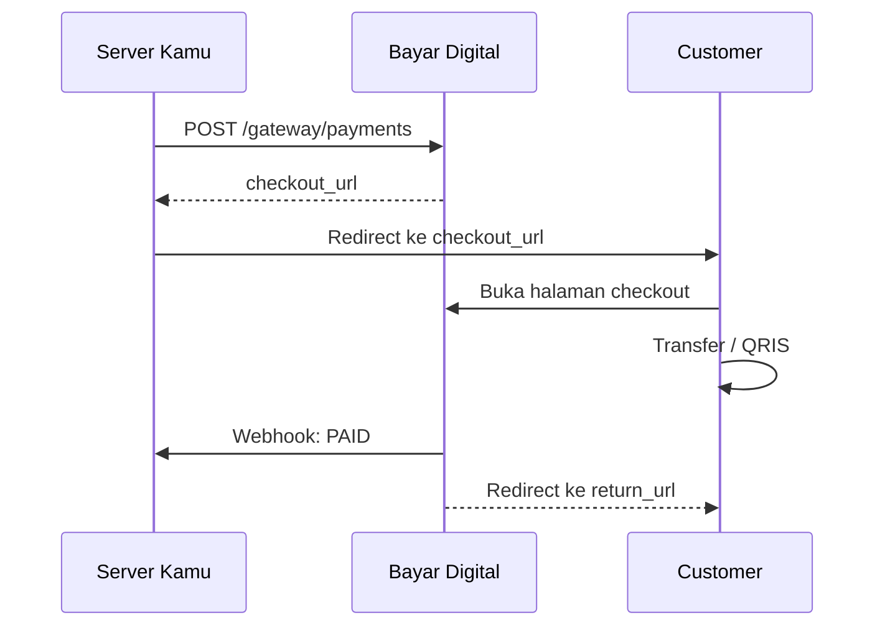

import Tabs from '@theme/Tabs';
import TabItem from '@theme/TabItem';

# Checkout

Halaman publik Bayar Digital untuk customer melakukan pembayaran. Customer **tidak perlu login** atau punya akun.

Setelah invoice dibuat, kamu bisa redirect customer ke halaman checkout ini. `payment_checkout_url` diberikan saat create payment sebagai URL absolut penuh.

**Alternatif:** Kalau tidak ingin redirect, kamu bisa tampilkan detail pembayaran (nomor rekening, nominal total, instruksi) di UI kamu sendiri. Ambil data dari response `POST /gateway/payments` atau `GET /gateway/payments/{code}`, lalu pantau status via [Webhook](./webhook).

## Alur Redirect

<table>
<thead>
<tr><th>Status</th><th>Tampilan</th></tr>
</thead>
<tbody>
<tr><td>`PENDING`</td><td>Instruksi pembayaran, nominal total, batas waktu mundur</td></tr>
<tr><td>`PAID`</td><td>Konfirmasi sukses + tombol kembali ke merchant</td></tr>
<tr><td>`EXPIRED` / `CANCELLED`</td><td>Halaman tidak tersedia</td></tr>
</tbody>
</table>

**Transfer bank:** menampilkan nomor rekening dan nominal `payment_total`.
**QRIS:** menampilkan QR Code dinamis dengan nominal spesifik.

### return_url

- Customer otomatis redirect ke `return_url` setelah status `PAID`
- Parameter `?payment_code={payment_code}` otomatis ditambahkan
- Hanya HTTPS yang diizinkan

**Jangan** jadikan redirect sebagai sumber kebenaran. Gunakan **webhook** untuk memastikan status payment.
