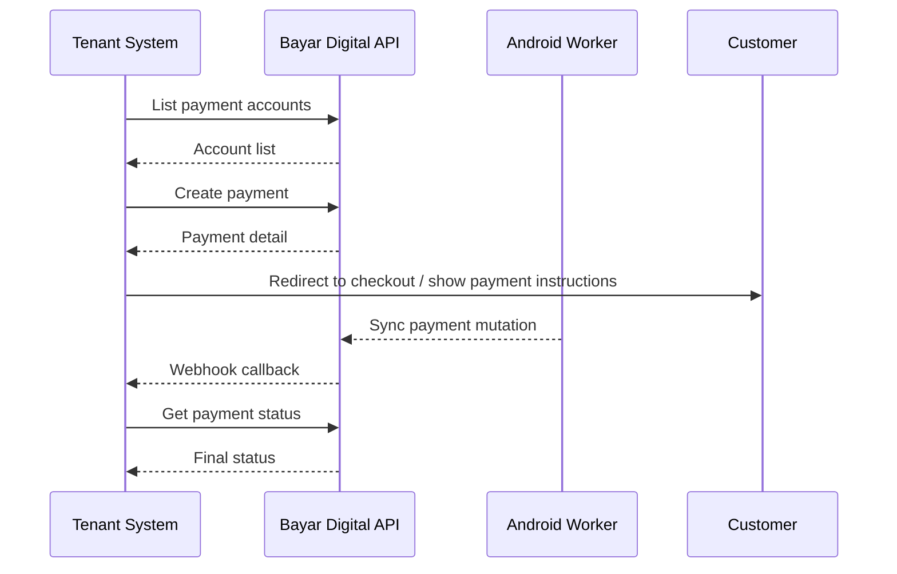

# Overview

Dokumentasi ini ditujukan untuk developer tenant yang ingin menghubungkan sistem internal dengan **Bayar Digital Payment Gateway**.

Integrasi dilakukan dari server tenant ke API Bayar Digital. API key tidak boleh dikirim dari browser, aplikasi mobile customer, atau aplikasi lain yang tidak berada di kontrol backend tenant.

## Base URL

| Environment | Base URL |
| --- | --- |
| Production | `https://api.bayar.digital` |

Format endpoint gateway:

```text
{base_url}/api/gateway/{resource}
```

## Alur Integrasi

1. Sistem tenant mengambil payment account yang aktif.
2. Sistem tenant membuat payment dengan `payment_code` dari order internal.
3. Bayar Digital mengembalikan detail payment, nominal total, dan `checkout_url`.
4. Customer menyelesaikan pembayaran melalui instruksi atau halaman checkout.
5. Android Worker membaca mutasi dari akun pembayaran tenant.
6. Bayar Digital mencocokkan mutasi dan mengubah status payment.
7. Bayar Digital mengirim webhook ke `callback_url` tenant.
8. Sistem tenant melakukan rekonsiliasi dengan webhook atau endpoint get payment.



## Integrasi Minimum

Tenant perlu menyiapkan komponen berikut:

| Komponen | Fungsi |
| --- | --- |
| Backend tenant | Menyimpan API key dan memanggil API gateway. |
| Order/payment table | Menyimpan `payment_code`, `payment_id`, nominal, dan status. |
| Webhook endpoint | Menerima perubahan status payment dari Bayar Digital. |
| Checkout redirect | Mengarahkan customer ke `checkout_url` atau menampilkan instruksi pembayaran dari detail payment. |
| Reconciliation job | Mengecek status payment jika webhook gagal atau terlambat. |

## Response Format

Semua response sukses memakai format umum berikut:

```json
{
  "success": true,
  "message": "ok",
  "data": {}
}
```

Response error memakai format berikut:

```json
{
  "success": false,
  "code": "error_code",
  "message": "Pesan error"
}
```

Response paginated memakai `meta`:

```json
{
  "success": true,
  "message": "ok",
  "data": [],
  "meta": {
    "page": 1,
    "per_page": 20,
    "total": 50,
    "total_pages": 3
  }
}
```

## Checklist Integrasi

1. Buat atau aktifkan merchant tenant di dashboard.
2. Simpan API key di environment backend tenant.
3. Pastikan payment account aktif dan Android Worker berjalan.
4. Panggil `GET /api/gateway/accounts` untuk memilih `merchant_account_id`.
5. Buat payment dari order internal dengan `POST /api/gateway/payments`.
6. Simpan `payment_code`, `id`, `amount_total`, `status`, dan `checkout_url`.
7. Redirect customer ke `checkout_url` atau tampilkan instruksi pembayaran.
8. Terima webhook dan update status order secara idempotent.
9. Gunakan get payment untuk fallback rekonsiliasi.
