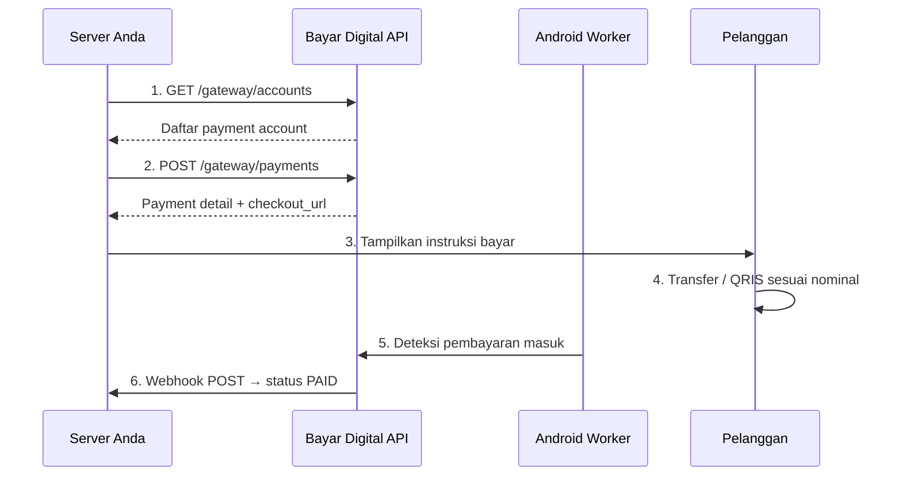

# Panduan Integrasi Bayar Digital

Dokumentasi integrasi Payment Gateway Bayar Digital untuk developer. Sistem Anda dapat membuat invoice, mengecek status, dan menerima notifikasi real-time secara otomatis.

**Konfigurasi API**
* **Base URL:** `https://api.bayar.digital` (gunakan *prefix* `/gateway/`).
* **Autentikasi:** Kirimkan API Key pada *header* `X-Api-Key` di setiap *request*. Dapatkan *key* (`pk_...`) dari Dashboard [Merchant](https://bayar.digital/tenant/merchants) dan simpan aman di *environment variable*.
* **Webhook Endpoint:** Siapkan *endpoint* di server Anda untuk menerima notifikasi perubahan status transaksi.

## Alur Kerja Utama

1. **Ambil Akun:** Panggil `GET /gateway/accounts` untuk melihat daftar rekening tujuan.
2. **Buat Invoice:** Panggil `POST /gateway/payments` untuk mendapatkan nominal transfer unik dan URL *checkout*.
3. **Pembayaran:** Pelanggan melakukan transfer sesuai instruksi.
4. **Deteksi Otomatis:** Aplikasi Android Worker mendeteksi mutasi transfer masuk.
5. **Notifikasi:** Server menerima *webhook* berstatus `PAID` untuk memproses pesanan.

---

### Android Worker

Bayar Digital Worker adalah aplikasi Android pendukung khusus [Merchant](https://bayar.digital/tenant/merchants) yang bertugas menangkap dan meneruskan notifikasi transaksi masuk dari *mobile banking* ke sistem [bayar.digital](https://bayar.digital).

Worker bekerja secara spesifik hanya pada bank yang Anda izinkan via [Pengelola Rekening](https://bayar.digital/tenant/accounts). Notifikasi dari aplikasi lain atau info perbankan non-transaksi **TIDAK PERNAH** dikirim ke server. Gerbang 2 lapis (Worker + Sistem) otomatis memblokir semua data di luar mutasi masuk — privasi Anda dipastikan aman.

### ⚠️ Informasi Penting: Peringatan Keamanan (Play Protect)

Karena aplikasi ini diunduh langsung dari sistem kami (bukan melalui Google Play Store) dan menggunakan fitur pemantauan latar belakang, fitur keamanan bawaan Android **(Google Play Protect)** kemungkinan akan memunculkan peringatan saat proses instalasi (seperti peringatan *"Aplikasi tidak dikenal"* atau *"Unsafe app blocked"*).

**Hal ini sangat wajar untuk aplikasi internal bisnis.** Sistem Google secara otomatis menandai aplikasi di luar Play Store yang membaca notifikasi. Untuk melanjutkan instalasi dengan aman:

1. Saat layar peringatan Play Protect merah muncul, klik tulisan **"Detail selengkapnya"** (*More details*).
2. Pilih opsi **"Tetap instal"** (*Install anyway*).
3. Jika muncul *pop-up* yang meminta mengirim aplikasi untuk dipindai, Anda cukup memilih **"Jangan kirim"** (*Don't send*).

### Syarat Perangkat

* HP Android dengan koneksi Internet.
* Aplikasi *mobile banking* (seperti BCA Mobile, Livin', dll.) sudah terinstal dan akun aktif di HP tersebut.
* Fitur notifikasi (*push notification*) pada aplikasi *mobile banking* wajib dalam keadaan **aktif**.

### Langkah Instalasi & Konfigurasi

1. Klik tombol **Unduh Worker APK** di sudut kanan atas pada halaman [Pairing Device](https://bayar.digital/tenant/devices).
2. Instal APK pada HP Android (ikutilah panduan melewati *Play Protect* di atas jika muncul peringatan).
3. Buka aplikasi Worker yang sudah terinstal, lalu **berikan semua izin akses** yang diminta oleh layar.
4. Masukkan **API Key** (yang bisa Anda dapatkan pada halaman [Merchant](https://bayar.digital/tenant/merchants)) ke dalam aplikasi Worker.
5. Kembali ke halaman [Pairing Device](https://bayar.digital/tenant/devices), lalu klik **Setujui** pada daftar perangkat HP yang baru masuk.

> **Indikator Keberhasilan:**
> Worker sudah berjalan normal dan siap menerima transaksi masuk jika bar notifikasi HP Anda secara konstan menampilkan pesan: *"Listening for bank notifications"*.