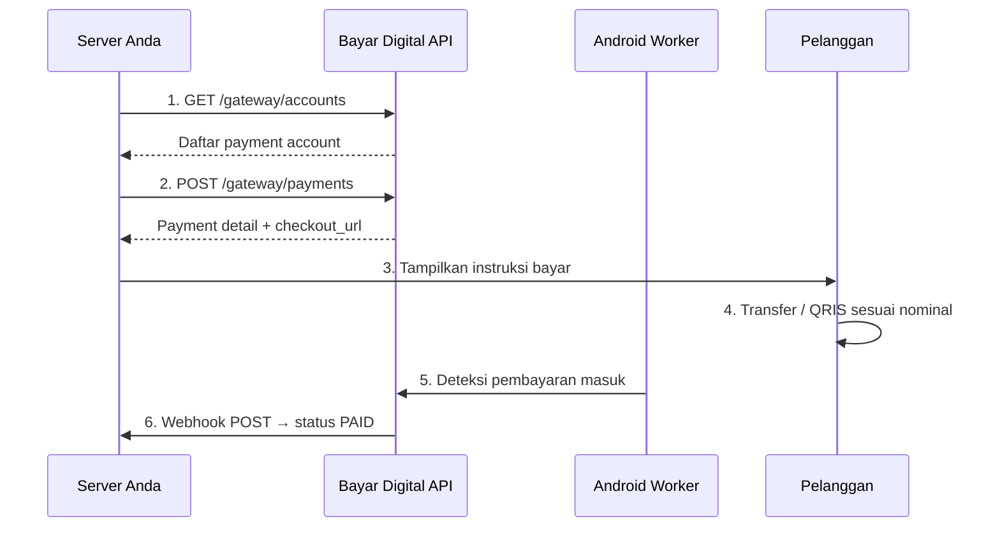

# Panduan Integrasi Bayar Digital

Dokumentasi integrasi Payment Gateway Bayar Digital untuk developer. Sistem Anda dapat membuat invoice, mengecek status, dan menerima notifikasi real-time secara otomatis.

## Alur Kerja Utama

1. **Ambil Akun:** Panggil `GET /gateway/accounts` untuk melihat daftar rekening tujuan.
2. **Buat Invoice:** Panggil `POST /gateway/payments` untuk mendapatkan nominal transfer unik dan URL *checkout*.
3. **Pembayaran:** Pelanggan melakukan transfer sesuai instruksi.
4. **Deteksi Otomatis:** Aplikasi Android Worker mendeteksi mutasi transfer masuk.
5. **Notifikasi:** Server menerima *webhook* berstatus `PAID` untuk memproses pesanan.

---

## Persiapan Sistem

**1. Konfigurasi API**
* **Base URL:** `https://api.bayar.digital` (gunakan *prefix* `/gateway/`).
* **Autentikasi:** Kirimkan API Key pada *header* `X-Api-Key` di setiap *request*. Dapatkan *key* (`pk_...`) dari Dashboard Merchant dan simpan aman di *environment variable*.
* **Webhook Endpoint:** Siapkan *endpoint* di server Anda untuk menerima notifikasi perubahan status transaksi.

**2. Ketentuan Rate Limit**
* **Read (GET):** Maksimal 3.000 request/menit.
* **Write (POST/DELETE):** Maksimal 600 request/menit.
* Melebihi batas akan mengembalikan error `rate_limited`.

---

## Android Worker

Worker adalah aplikasi Android yang berfungsi sebagai "mata" sistem untuk membaca notifikasi aplikasi *mobile banking* dan mendeteksi pembayaran masuk secara otomatis.

**Syarat Perangkat:**
* Gunakan HP Android khusus (bukan HP pribadi) yang selalu menyala, terhubung listrik, dan terkoneksi internet 24 jam.
* Aplikasi *mobile banking* (BCA Mobile, Livin', dll) wajib terinstal dan aktif di perangkat yang sama.

**Langkah Instalasi:**
1. Unduh APK dari Dashboard -> menu **Pairing Device**.
2. Instal di HP khusus, buka aplikasi, dan masukkan API Key.
3. Login ke Dashboard -> **Pairing Device**, lalu klik **Setujui** pada perangkat yang baru mendaftar.
4. **Perizinan Wajib:** Berikan izin Notifikasi, Akses Notifikasi (*Notification Access* via *Settings* HP), dan pastikan fitur Optimasi Baterai / Penghemat Daya dinonaktifkan untuk aplikasi Worker.
5. Worker berjalan normal jika menampilkan notifikasi *"Listening for bank notifications"*.

**Troubleshooting Payment PENDING:**
Jika pelanggan sudah transfer namun sistem tidak mendeteksi:
* Periksa apakah HP mati atau internet terputus.
* Pastikan sistem Android tidak mematikan Worker di latar belakang (cek pengaturan baterai).
* Pastikan izin *Notification Access* tidak dicabut oleh OS.
* Pastikan notifikasi transaksi masuk dari aplikasi bank benar-benar muncul di panel notifikasi HP tersebut.