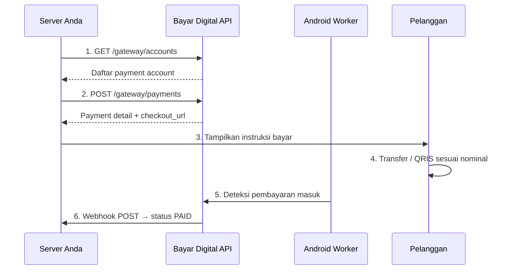

# Panduan Integrasi Bayar Digital

Dokumentasi integrasi Payment Gateway Bayar Digital untuk developer. Sistem Anda dapat membuat invoice, mengecek status, dan menerima notifikasi real-time secara otomatis.

## Alur Kerja Utama

1. **Ambil Akun:** Panggil `GET /gateway/accounts` untuk melihat daftar rekening tujuan.
2. **Buat Invoice:** Panggil `POST /gateway/payments` untuk mendapatkan nominal transfer unik dan URL *checkout*.
3. **Pembayaran:** Pelanggan melakukan transfer sesuai instruksi.
4. **Deteksi Otomatis:** Aplikasi Android Worker mendeteksi mutasi transfer masuk.
5. **Notifikasi:** Server menerima *webhook* berstatus `PAID` untuk memproses pesanan.

---

## Persiapan Sistem

**Konfigurasi API**
* **Base URL:** `https://api.bayar.digital` (gunakan *prefix* `/gateway/`).
* **Autentikasi:** Kirimkan API Key pada *header* `X-Api-Key` di setiap *request*. Dapatkan *key* (`pk_...`) dari Dashboard [Menu Merchant](https://bayar.digital/tenant/merchants) dan simpan aman di *environment variable*.
* **Webhook Endpoint:** Siapkan *endpoint* di server Anda untuk menerima notifikasi perubahan status transaksi.

---

## Android Worker

Worker adalah aplikasi Android pendukung yang bertugas menangkap dan meneruskan hanya notifikasi transaksi masuk dari mobile banking ke sistem ini. Worker bekerja secara spesifik pada bank yang Anda izinkan via Dashboard. Notifikasi dari aplikasi lain atau info bank non-transaksi TIDAK PERNAH dikirim ke server. Gerbang 2 lapis (Worker + Sistem) otomatis memblokir semua data di luar mutasi masuk — privasi Anda dipastikan aman.

**Syarat Perangkat**

* HP Android dengan koneksi Internet.
* Aplikasi mobile banking (BCA Mobile, Livin', dll.) sudah terinstal dan aktif di HP tersebut.
* Pastikan notifikasi pada aplikasi mobile banking diaktifkan.

**Langkah Instalasi**

1. Klik tombol **Unduh Worker APK** di sudut kanan atas pada halaman [Pairing Device](https://bayar.digital/tenant/devices).
2. Instal APK pada HP Android, buka aplikasi, lalu berikan izin akses yang diminta.
3. Setelah izin diberikan, masukkan **API Key** yang didapat pada halaman [Menu Merchant](https://bayar.digital/tenant/merchants) ke dalam aplikasi.
4. Kembali ke halaman [Pairing Device](https://bayar.digital/tenant/devices) dan klik **Setujui** pada daftar HP yang baru masuk.

**Perizinan Wajib**

* **Akses Notifikasi:** Berikan izin Notification Access pada pengaturan HP agar sistem dapat membaca mutasi.
* **Abaikan Optimasi Baterai:** Nonaktifkan penghemat daya khusus untuk aplikasi Worker agar proses tetap berjalan stabil di latar belakang (tidak ditutup otomatis oleh sistem Android).

Worker berjalan normal jika menampilkan notifikasi **"Listening for bank notifications"**.