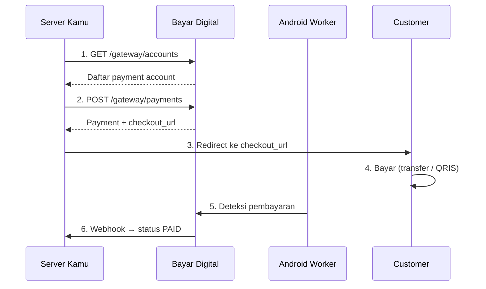

# Overview

Dokumentasi integrasi payment gateway Bayar Digital untuk developer tenant.

## Base URL

```
https://api.bayar.digital
```

Semua endpoint gateway menggunakan prefix `/gateway/`.

## Persiapan

1. Daftar dan login ke [dashboard](https://bayar.digital)
2. Buat merchant → salin **API Key** (`pk_...`)
3. Setup Android Worker di perangkat khusus ([detail](./android-worker))

## Cara Kerja



**Singkatnya:**

1. Ambil daftar payment account → pilih `merchant_account_id`
2. Buat payment → dapat `checkout_url` + `amount_total`
3. Redirect customer ke checkout
4. Customer bayar
5. Android Worker otomatis deteksi pembayaran
6. Kamu terima webhook → update order

## Yang Perlu Kamu Siapkan

| Komponen | Fungsi |
| --- | --- |
| Backend server | Simpan API key, panggil API gateway |
| Tabel order/payment | Simpan `payment_code`, `amount_total`, `status` |
| Webhook endpoint | Terima notifikasi perubahan status payment |
| Reconciliation job | Cek status payment berkala sebagai fallback |

## Response Format

**Sukses:**

```json
{
  "success": true,
  "message": "ok",
  "data": {}
}
```

**Error:**

```json
{
  "success": false,
  "code": "ERROR_CODE",
  "message": "Pesan error"
}
```

**Paginated:**

```json
{
  "success": true,
  "data": [],
  "meta": {
    "page": 1,
    "per_page": 20,
    "total": 50,
    "total_pages": 3
  }
}
```
