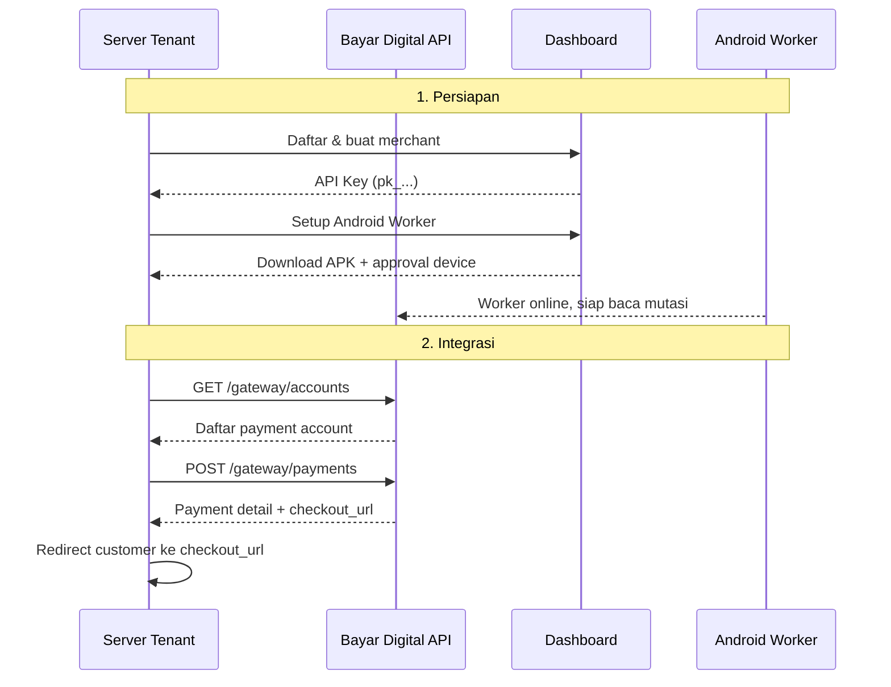

# Quickstart

Dapatkan payment pertama terverifikasi dalam 30 menit.

## Arus End-to-End



## Langkah 1 — Persiapan Akun

1. Hubungi operator Bayar Digital untuk mendapat akses dashboard.
2. Di dashboard, buat atau aktifkan **merchant tenant**.
3. Dari halaman merchant, salin **API key** (format `pk_...`). Simpan aman — ini kredensial utama integrasi.
4. Daftarkan perangkat Android untuk **Android Worker**.
5. Instal APK worker di perangkat yang khusus dipakai untuk worker.

## Langkah 2 — Dapatkan Payment Account

Worker sudah online. Sekarang ambil daftar akun pembayaran yang bisa dipakai.

```bash
curl https://api.bayar.digital/gateway/accounts \
  -H "X-Api-Key: pk_..."
```

Response berisi daftar akun transfer dan QRIS. Pilih satu, catat `id` sebagai `merchant_account_id`.

## Langkah 3 — Buat Payment

Buat payment pertama dengan `payment_code` dari sistem tenant:

```bash
curl -X POST https://api.bayar.digital/gateway/payments \
  -H "Content-Type: application/json" \
  -H "X-Api-Key: pk_..." \
  -d '{
    "payment_code": "INV-2026-0001",
    "merchant_account_id": "550e8400-e29b-41d4-a716-446655440000",
    "amount": 50000,
    "customer_name": "Budi Santoso",
    "customer_email": "budi@example.com",
    "customer_phone": "081234567890",
    "expired_at": 1791691200000,
    "callback_url": "https://tenant.example.com/webhooks/bayar-digital",
    "return_url": "https://tenant.example.com/orders/INV-2026-0001"
  }'
```

Response berisi detail payment termasuk `checkout_url`.

## Langkah 4 — Arahkan Customer

Redirect customer ke `checkout_url` atau tampilkan instruksi bayar dari detail payment:

- Nomor rekening + nominal → untuk transfer bank
- QRIS static → scan QRIS

## Langkah 5 — Terima Webhook

Saat customer membayar dan worker mendeteksi mutasi, Bayar Digital akan mengirim webhook ke `callback_url`:

```json
{
  "payment_id": "660e8400-e29b-41d4-a716-446655440010",
  "payment_code": "INV-2026-0001",
  "status": "PAID",
  "amount": 50123,
  "paid_at": "2026-06-11T10:05:00Z"
}
```

Balas dengan `200 OK` dan update order tenant sebagai lunas.

## Langkah 6 — Verifikasi (Opsional)

Gunakan `GET /gateway/payments/{payment_code}` untuk rekonsiliasi jika webhook tidak diterima.

## Selesai

Payment pertama sudah terverifikasi. Untuk pengembangan lebih lanjut:

| Topik | Tujuan |
| --- | --- |
| [Overview](./overview) | Memahami arsitektur gateway secara keseluruhan |
| [Checkout](./checkout) | Pengalaman customer dari checkout sampai bayar |
| [Webhook](./webhook) | Implementasi callback handler yang idempotent |
| [Error Handling](./error-handling) | Pola retry, backoff, dan penanganan error |
| [Status Code](./status-code) | Referensi lengkap kode error dan HTTP status |
