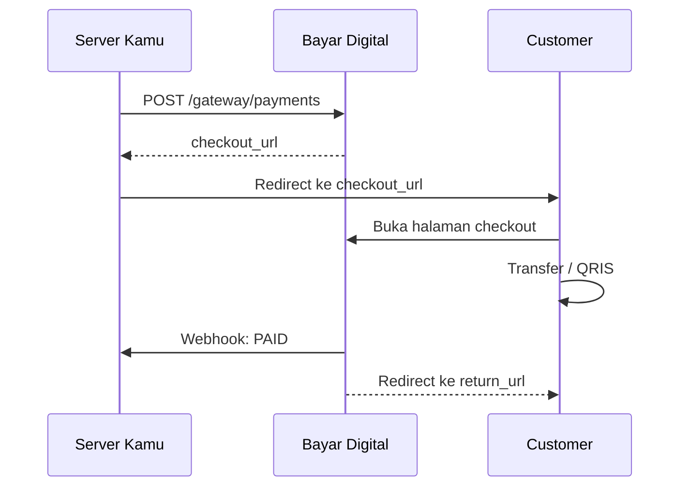

# Checkout

Halaman publik Bayar Digital untuk customer melakukan pembayaran. Customer **tidak perlu login** atau punya akun.

:::info
Setelah invoice dibuat, kamu bisa redirect customer ke halaman checkout ini. `payment_checkout_url` diberikan saat create payment sebagai URL absolut penuh.

**Alternatif:** Kalau tidak ingin redirect, kamu bisa tampilkan detail pembayaran (nomor rekening, nominal total, instruksi) di UI kamu sendiri. Ambil data dari response `POST /gateway/payments` atau `GET /gateway/payments/{code}`, lalu pantau status via [Webhook](./webhook).
:::

## Alur Redirect



### Yang Customer Lihat

| Status | Tampilan |
|--------|----------|
| `PENDING` | Instruksi pembayaran, nominal total, batas waktu mundur |
| `PAID` | Konfirmasi sukses + tombol kembali ke merchant |
| `EXPIRED` / `CANCELLED` | Halaman tidak tersedia |

**Transfer bank:** menampilkan nomor rekening dan nominal `payment_total`.
**QRIS:** menampilkan QR Code dinamis dengan nominal spesifik.

### return_url

- Customer otomatis redirect ke `return_url` setelah status `PAID`
- Parameter `?payment_code={payment_code}` otomatis ditambahkan
- Hanya HTTPS yang diizinkan

:::warning
**Jangan** jadikan redirect sebagai sumber kebenaran. Gunakan **webhook** untuk memastikan status payment.
:::

---

## Public API

Halaman checkout menggunakan endpoint publik (tanpa autentikasi).

<Tabs>
  <TabItem value="request" label="Request" default>
    <Tabs>
      <TabItem value="endpoint" label="Endpoint" default>
        | Method | URL |
        |--------|-----|
        | `GET` | `/checkout/{payment_id}` |
      </TabItem>
      <TabItem value="param" label="Param">
        | Parameter | Tipe | Wajib | Deskripsi |
        |-----------|------|-------|-----------|
        | `payment_id` | uuid | Ya | ID invoice (dari `payment_checkout_url`) |
      </TabItem>
      <TabItem value="header" label="Header">
        Endpoint publik — tidak perlu header.
      </TabItem>
      <TabItem value="body" label="Body">
        Tidak ada request body (GET).
      </TabItem>
      <TabItem value="contoh" label="Contoh">
        ```bash
        curl https://api.bayar.digital/checkout/660e8400-e29b-41d4-a716-446655440010
        ```
      </TabItem>
    </Tabs>
  </TabItem>
  <TabItem value="response" label="Response">
    <Tabs>
      <TabItem value="sukses" label="Sukses" default>
        **Transfer Bank:**
        ```json
        {
          "success": true,
          "message": "ok",
          "data": {
            "payment_code": "INV-2026-0001",
            "amount_original": 50000,
            "amount_unique": 123,
            "amount_total": 50123,
            "status": "PENDING",
            "expires_at": "2026-10-11T12:00:00Z",
            "created_at": "2026-06-11T10:00:00Z",
            "customer_name": "Budi Santoso",
            "customer_email": "budi@example.com",
            "customer_phone": "081234567890",
            "return_url": "https://yourserver.com/orders/INV-2026-0001",
            "redirect_url": "https://yourserver.com/orders/INV-2026-0001?payment_code=INV-2026-0001",
            "order_items": "[{\"name\":\"Produk A\",\"price\":50000,\"quantity\":1,\"subtotal\":50000}]",
            "account_number": "1234567890",
            "account_name": "PT Merchant Contoh",
            "bank_name": "BCA",
            "bank_type": "TRANSFER",
            "app_name": "BCA Mobile",
            "instructions": "[]"
          }
        }
        ```

        **QRIS — Field Tambahan:**
        | Field | Tipe | Deskripsi |
        |-------|------|-----------|
        | `qris_id` | string/null | NMID merchant |
        | `qris_name` | string/null | Nama merchant |
        | `qris_city` | string/null | Kota |
        | `qris_payload` | string/null | QRIS content string (untuk generate QR Code) |

        :::info
        `qris_payload` bersifat **dinamis** dengan nominal spesifik. Static QR tidak pernah diekspos.
        :::
      </TabItem>
      <TabItem value="gagal" label="Gagal">
        ```json
        {
          "success": false,
          "code": "not_found",
          "message": "payment not found"
        }
        ```
      </TabItem>
    </Tabs>
  </TabItem>
</Tabs>

## Response Fields

| Field | Tipe | Deskripsi |
|-------|------|-----------|
| `payment_code` | string | Kode invoice |
| `amount_original` | int64 | Nominal asli (tanpa nominal unik) |
| `amount_unique` | int64 | Nominal unik |
| `amount_total` | int64 | Total yang harus dibayar |
| `status` | string | Status payment |
| `expires_at` | datetime | Batas waktu pembayaran |
| `created_at` | datetime | Waktu pembuatan |
| `customer_name` | string | Nama customer |
| `customer_email` | string/null | Email customer |
| `customer_phone` | string/null | Telepon customer |
| `return_url` | string/null | Redirect URL |
| `redirect_url` | string/null | URL redirect dengan parameter `payment_code` |
| `order_items` | string | Item pesanan (JSON string) |
| `account_number` | string | Nomor rekening tujuan |
| `account_name` | string | Nama pemilik rekening |
| `bank_name` | string | Nama bank |
| `bank_type` | string | `TRANSFER` |
| `app_name` | string | Nama aplikasi mobile banking |
| `instructions` | string | Instruksi pembayaran (JSON string) |

---

**Lanjutan:** Pantau status pembayaran via [Payment Get](./payment-get) atau setup [Webhook](./webhook) untuk notifikasi otomatis.
